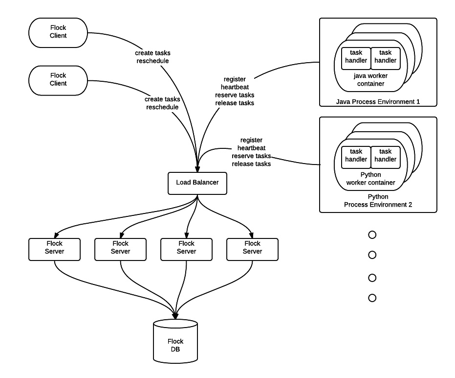
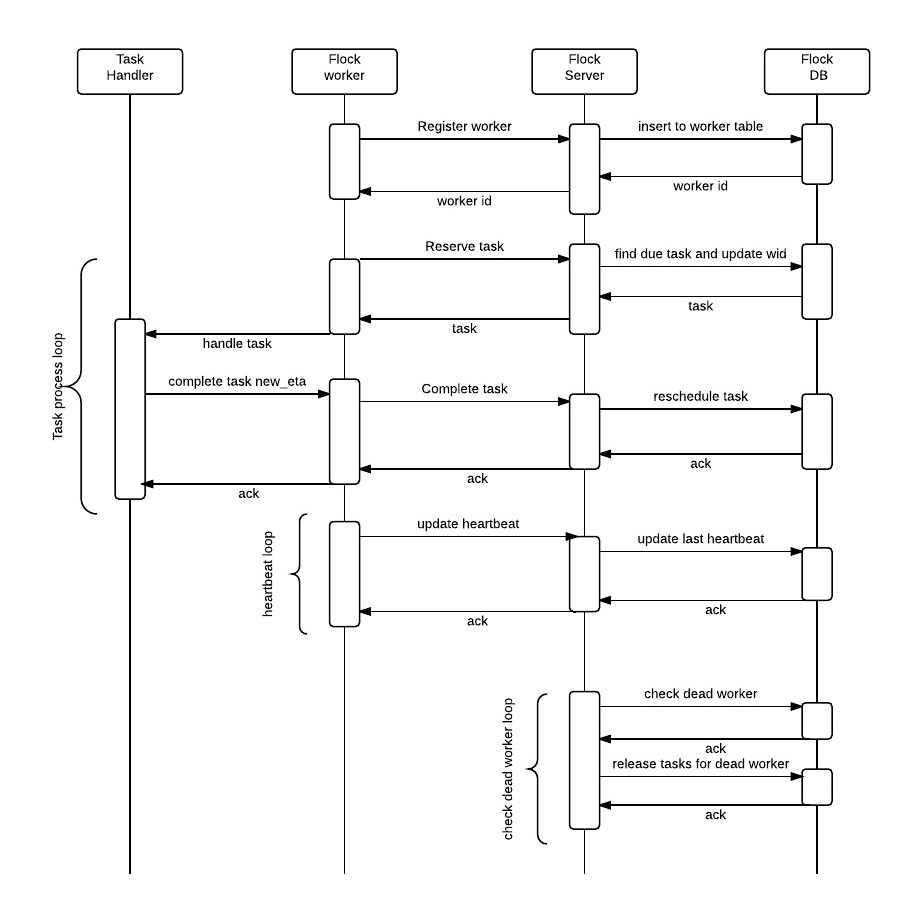
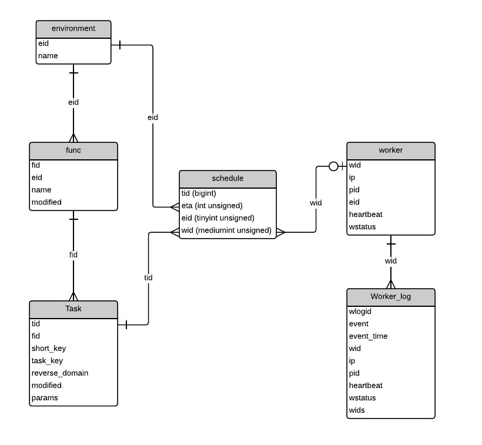

# Flock

Flock is a scalable task scheduler and distributor. 

Flock is first developed at Flipboard to schedule millions.=Flock can be used to schedule millions of tasks 
and then distribute them among dynamic number of worker servers to execute these tasks when they are due. 
For example, you need to crawl tens of millions RSS feeds at different cadence depending their update
frequency. You can use Flock to schedule and distribute the load to large number of worker processes. 

Flock server expose REST API for client to schedule and manage tasks. Flock workers also use the REST
API to register worker instance, request tasks to process and acknowledge when task is complete. 
 
Worker process can be implemented in programming language of choice. For Java and Python worker, Flock
source come with sample worker containers that ease the deployment of Flock worker cluster. 
 
  
 
 
## Flock server cluster

Flock server provide REST service for flock client to create and manage tasks and for Flock worker
clusters to reserve tasks. 

## Flock client

Any processes that need to create, update, reschedule tasks using REST API. This could include 
worker cluster processes too. 

## Flock DB

Flock database that persists task, worker, func info. 

## Flock worker clusters

Large number of machines with computing resources to process tasks.  Worker clusters can be grouped
by environments. One type of grouping can be based on worker programming language. 

 
# Flock Component Interactions
 
 High level interaction between Flock worker and Flock server:
 
 1. When worker process starts, it registers with Flock server and obtain an unique worker ID (wid)

 2. Worker starts number of threads to run the task processing loop
  
 3. worker start a single thread to run update heartbeat loop
 
## Task processing loop
 
 1. Worker can then use the wid to reserve task to process.
 
 2. If a task is successfully reserved, worker invokes in-process Task Handler to process the task.
 
 3. Task handler perform domain specific processing logic.
 
 4. After Task handler performs the task, it also calculates and returns the next ETA for this task.
 
 5. For one time task, Task handler returns null and the task will be removed from schedule.
 
## Worker Heartbeat loop
 Worker need to maintain heartbeat with Flock server to indicate it's alive. It calls an REST API 
 to update the heartbeat and optional worker status.
 
## Server check for dead worker loop:
 Server periodically check for dead worker whose heartbeat is older than configured allowance. 
 If found, server will delete the worker record and release any tasks reserved by the worker so 
  other live workers will be able to reserve and execute them.
 
 
# Flock development process

 
 1. Implement task handler: task handler takes task as input with:
     
     * task_key : a string uniquely identifies the task for the function, e.g. URL, user id, etc.
     
     * params: an optional json block associated with the task. It can host any state for the task.
     
     * eta: the time in epoch when the task is scheduled
 
     * tid: task id
     
     * fid: function id for the task
     
     Task handler execute the take 
     
     Calculate and return the new ETA for the task if any.

 2. Create function record using POST /func/ {"env" : "java", "name": "function name"}
    This returns a function id.
  
 3. In worker code, invoke task handler in step 1 based on task function id from step 2.
 

# Flock DB schema

 
 
## environment

Execution environment for tasks and worker such as Java or Python. Both worker and task need to
belong to the same execution environment for worker to process the task.
 
 * cardinality: 10

## func

Task function definition. A task function should 

 * take task key and optional params (in json),
 * process the task and produce side effects such as crawling url, flip the content and 
     save results in storage. It can also schedule more tasks as result of processing the task, 
     e.g., crawler discovered more url to crawl.
 * calculate the new eta for reschedule the task. nil for one time task.
 * cardinality: 10^3

## worker

A process identified by ip and pid that can process task for a given environment. A worker should

 * registers with Flock server on start up 
 * spawn number of processing threads to fully utilize its processing resources such as
   CPU, memory, and network capacity. 
 * periodically update its heartbeat.
 * If a worker's heartbeat is older than configured time period, flock server will regard 
   the worker as dead and reassigned its reserved tasks to other workers.
 * cardinality: 10^4
 
## task

A task contains info required for function to be executed. 

 * task_key is a unique string within a given function (fid), such as URL or use id.
 * short_key is used for unique index. It stores the full task_key if it fit, otherwise apply sha1
 * reverse_domain is populated if the task_key is a url
 * cardinality: 10^9

 
## schedule

The task schedule for tasks 

 * eta is epoch time at which the task should be executed
 * wid is the worker id that reserved this task. 0 for tasks not reserved by any worker
 * cardinality: 10^9

# Flock Server

Provide REST API for
 
  1. clients to create, schedule tasks
  
  2. worker to register, reserve and complete tasks.
   
## function

Create function:
> POST /func
> {"name": "<method name>", "env": "python"}

> GET /fun/:fid
> {"fid": 1, "name": "<method name>", "env": "python"}

## task

> POST /task
> {"fid": <func id>, "task_key": "<task key>", "eta": <eta in epoch>,
>  "params": <params in json (optional)>}

> GET /task/:tid
> response: {"fid": <func id>, "task_key": "<task key>", "eta": <eta in epoch>,
>  "params": <params in json (if any)>, "modified": <last modified time>}

> PUT /task/:tid  (update heartbeat)
> {"eta": <new eta in epoch>, "params": <params in json (optional)>}

    
## worker

Worker should:

 1. on startup
    > POST /worker 
    > {"ip": "<worker ip address>", "pid": <worker pid>, "cap": "python"}
                
 2. Every heartbeat seconds, it should update heartbeat at:
    > PUT /worker/:wid

 3. reserve task to process,
    > GET /worker/:wid/task
    > response: {"tid": <tid>, "eta": <eta>, "wid": <wid>, "fid":<fid>, "task_key": "<task key>",
    >            "params": <params in json if any>}
 
 4. complete task 
    > PUT /worker/:wid/task/:tid
    > {"new_eta": <new eta in epoch if any>, "error": <if any error during processing>}

# Deployment

## build

### build Flock uberjar

  checkout flock (following example check it out under ~/dev/flock)

    > cd ~/dev/flock
    > lein uberjar

  The standalone uberjar is in
    ~/dev/flock/target/uberjar/flock-standalone.jar

### configuration

  see comments in flock.properties for details

## starting flock service locally

  1. start mysql locally
  
  2. create database flockopen
  
  3. create database flocklogopen
  
  4. under flock/sql dir
  
      > cat flock-schema.sql | mysql -u root -h localhost --password=root flockopen
            
      > cat flock-log-schema.sql | mysql -u root -h localhost --password=root flocklogopen
  
  5. start server
  
      > java -Dlog4j.configuration=file:./log4j.properties -jar target/uberjar/flock-standalone.jar  &

  6. check log under /mnt/log/flock/flock.log (this is configured in log4j.properties)
  
  7. verify the server is working, in browser go to localhost:8080 to see the admin page.
     (most are empty)

## License

Copyright (C) 2014-2015 Howard Zhao and Flipboard core team

Licensed under the Eclipse Public License (the same as Clojure)

